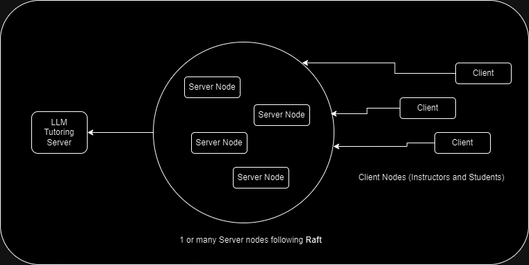

---

# LMS Project

This is a basic Learning Management System (LMS) built using Python, gRPC, and SQLite. The project implements login, logout, post, and get functionalities using gRPC, along with session management through tokens. The system can be interacted with through a command-line interface for both students and instructors.

## Index

- [Architecture](#architecture)
- [Project Structure](#project-structure)
- [Requirements](#requirements)
- [Setup Instructions](#setup-instructions)
- [Run the Project](#running-the-project)

## Architecture



(the arrows signify the direction in which a connection begins. Here, a server can not initiate a connection with a client, but can with a tutoring server, and so on) 

## Project Structure

```
/LMS_Project
│
├── /client
│   ├── client.py               # Command-line interface for interacting with the LMS
│   └── grpc_client.py          # gRPC client logic to communicate with the server
│
├── /server
│   ├── grpc_server.py          # Main gRPC server code handling RPC functions
│   ├── server.py               # Code to run the grpc server
│   ├── database.py             # SQLite database creation logic
│   └── initialize_content.py   # Python script to initialize dummy LMS course content
│
├── /raft
│   ├── logs_helper.py          # Helper functions for log files
│   └── raft_node.py            # Raft Client and Raft Server classes with gRPC connections
│
├── /proto
│   ├── lms.proto               # Protocol buffer file defining gRPC services and messages b/w Server and Client
│   ├── raft.proto              # Protocol buffer file defining gRPC services and messages for Raft Nodes
│   └── tutoring.proto          # Protocol buffer file defining gRPC services and messages b/w Server and LLM Server
│
├── requirements_server_client.txt            # Python dependencies for the server/client nodes (gRPC, SQLite, etc.)
├── requirements_tutoring_server.txt          # Python dependencies for the AI based tutoring server (gRPC, SQLite, PyTorch, etc.)
├── setup_server_client.sh                    # Setup for the server/client nodes
├── setup_tutoring_server.sh                  # Setup for the tutoring server
└── README.md                                 # this ReadMe file
```


## Requirements

- Python 3.8 or 3.9

## Setup Instructions

## With Setup file

### 1. Clone the repository
```bash
git clone https://github.com/UjjwalAggarwal-1/AOS-Adventure
cd AOS-Adventure
```


### 2. Run the setup.sh bash file
* You may create a virtual env and activate it before running the script

for the tutoring server node
```
./setup_tutoring_server.sh 
```

for the server or client nodes
```
./setup_server_client.sh 
```

incase the file is not executable, run

```
chmod +x {filename}
```

## Without Setup file

### 1. Clone the repository
```bash
git clone https://github.com/UjjwalAggarwal-1/AOS-Adventure
cd AOS-Adventure
```


### 2. Install Python Dependencies
* You may create a virtual env and activate it at this step

Install the required Python dependencies using `pip`:

for the server or client nodes
```bash
pip install -r requirements_server_client.txt 
```

for the tutoring server node
```bash
pip install -r requirements_tutoring_server.txt 
```

### 3. Generate gRPC Code from `lms.proto` and `tutoring.proto`

The project uses gRPC for communication. To generate the necessary Python files from the `lms.proto` file, run the following command:

```bash
python -m grpc_tools.protoc -I./proto --python_out=./proto --grpc_python_out=./proto ./proto/lms.proto
```

This will generate `lms_pb2.py` and `lms_pb2_grpc.py` inside the `/proto` directory.

similarly for `tutoroing.proto`
```bash
python -m grpc_tools.protoc -I./proto --python_out=./proto --grpc_python_out=./proto ./proto/tutoring.proto
```

### 4. Initialize Database Content (only for server node, not LLM server)

```bash
python ./server/database.py
python ./server/initialize_content.py
```

This will also insert some dummy course materials into the SQLite database.

### 5. Make a logs directory

```bash
mkdir logs
```


## Running the Project

### 1. Run Raft Node

Start the gRPC server and client (as 2 new threads) by running the following command:

```bash
python raft/raft_node.py {port_number}
```

The server will start listening for requests on port `port_number`.
Use 40051/40052/40053 for now

* These 3 are the only raft nodes for now, to include more, add them to the `peers` list in raft_node.py towards the end of the file

* Remember to start the LMS server (step 2) corresponding to each raft node 
  * for raft (40051) start LMS server (50051)
  * for raft (40052) start LMS server (50052)
  * so on

### 2. Run the LMS Server

Start the gRPC server by running the following command:

```bash
python server/server.py {port_number}
```

The server will start listening for requests on port `port_number`.
Use 50051/50052/50053 for now

#### To Stop the Server

To stop the gRPC server, simply press `CTRL + C` in the terminal where it is running.


### 3. Run the Tutoring Server

To run the LLM tutoring server:

```bash
python tutoring_server/tutoring_server.py 
```

The server will start listening for requests on port `60052`.

#### To Stop the Server

To stop the gRPC server, simply press `CTRL + C` in the terminal where it is running.

### 4. Run the Client

To run the client to interact with the LMS:

```bash
python client/client.py {server_port_number}
```

Use 50051/50052/50053 for `server_port_number` for now
The client will provide options for login, posting data, retrieving data, and logging out.

### 5. Using the LMS

Once the client is running, you can:
- Login using the following credentials:
  - username : 
    - instructor1/instructor2/instructor3 for instructor
    - student1/student2/student3/student4/student5 for student
  - password: password123 for all

- Using the `post` option : Post assignments, and queries as student, or grade assignments and reply to queries as instructors.
- Using the `get` option : Retrieve course materials and assignments, their grades, and queries and replies.
